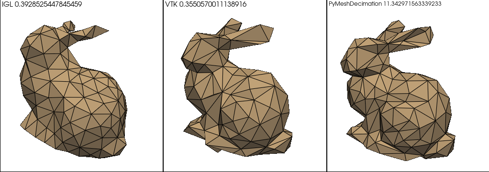

# PyMeshDecimation

Quadric Decimation for triangular meshes in Cython.

TODO :
Compare with 
https://github.com/jannessm/quadric-mesh-simplification/tree/master -> installation failed with pip -> try manually
https://github.com/Kramer84/pyfqmr-Fast-Quadric-Mesh-Reduction -> OK

VTK, IGL and PyFQMR use only one CPU to decimate the mesh.

Next Steps :

The main bottleneck of the current implementation is the _collapse function. For the moment, edges and costs are stored in (M, 2) and
(M) array and
- costs is not sorted
- edges does not have any particular structure

At each step of the process we must :
- find the minimum of costs (maybe not the current main bottleneck)
- find affected edges

It implies iterating over all edges twice. More efficient structures may reduce the compute time of the successive collapses.

Struct/Classes can be constructed in C++ and then imported in .pyx file (see pyfqmr), then we can benefit from the standard lib
of C++ to implement efficient structures.

Maintain two data structure :
ordered list edges/costs -> at every collapses, an edge must be removed and a few edges must be moved as costs change
neighboring structure -> list of (unfixed size) list (with C++ vectors ?)
